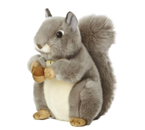

# Jieqian Learning Python
[GitHub: Jieqian-Learning-Python](https://github.com/Jieqian-Chen/Jieqian-Learning-Python)

[E-mail: jieqianchen@foxmail.com](mailto:jieqianchen@foxmail.com)

[TOC]


## 学习目标
1. 学习 Python 语言知识
2. 练习 GitHub Repositery 的操作
3. Markdown 语言使用
4. 熟悉 Pycharm 
5. 使用 Typora + Pandoc + CSS 将 .md 文件转换成**目标**格式的 .docx 文件
6. https://www.runoob.com/robots.txt 从 runoob 网上抓取 HTML / CSS 属性字典
## 学习资源
1. [Python语言程序设计_北京理工大学_中国大学MOOC(慕课)](https://www.icourse163.org/course/BIT-268001)
2. [selfteaching/the-craft-of-selfteaching: One has no future if one couldn't teach themself](https://github.com/selfteaching/the-craft-of-selfteaching)
3. [2020Python全栈开发+数据分析课程-培训视频教程-腾讯课堂](https://ke.qq.com/course/1347237?taid=6628259820506789)
## 参考文档书籍
1. [3.8.2 Documentation](https://docs.python.org/3/)
2. [python-3.8.2-docs-en.epub](books\python-3.8.2-docs-en.epub)
3. [Pycharm Keymap Reference](books\PyCharmKeymapReferenceCard.pdf) 
4. [The Python Language Reference, Release 3_8_2](books\The Python Language Reference, Release 3_8_2.pdf)
5. 
## 学习计划
1. 熟练使用工具
2. 设定学习近期目标
3. 查阅手册、搜索教程、达到阶段目标
4. 分析问题解决思路，拓展应用场景
5. 代码管理
6. VCS 
## 学习记录
不做囤积信息的松鼠，及时吸收关键信息，转换能使用的工具。



## Update:

### 更新日志

#### 2020/04/22

- 定向爬虫爬取最好大学 2019 高校排名
- 安装 beautifulsoup4 库
- 调整 keymap: 
1. Copy as plain text = Ctrl + Shift + C; 

2. Show in Explorer = Alt + Shift + E;

3. VCS Pull = Alt + Shift + I;

4. VCS Push = Alt + Shift + O;

   ```python
   # chr(12288) 中文空格，有效解决中文排版对不齐问题
   tplt = "{0:^10}\t{1:{3}^10}\t{2:^10}"
   print(tplt.format("排名","学校名称","总分",chr(12288)))
   ```

   

#### 2020/04/20

- 本地仓库统一存储在: C:\CJQ\'repname'
- 测试输出结果统一存储在: C:\CJQ\PythonOut
- 使用 Pycharm 远程管理 GitHub, 使用不同电脑，模拟多人协作，体会 VCS 的强大。

### keywords:
```python
True
False
None

not
and
or

if
elif
else

for
while
break
continue

def
lambda
pass
return
yield

try
except
finally
raise
assert

from
import
as

global
nonlocal

class
del
with
async
await

```

